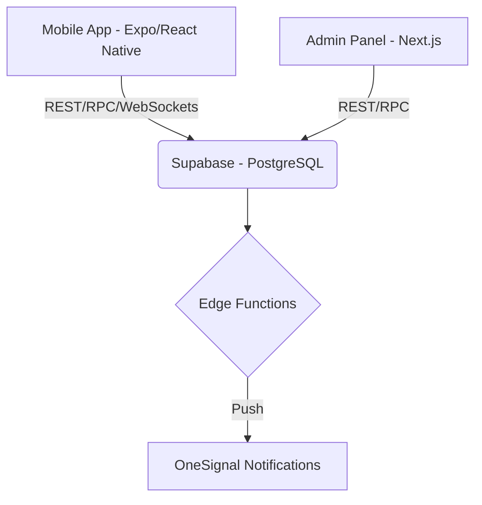

<div align="center">
  

  # AquaKart 2.0 💧

  **The Ultimate Real-Time Water Supply & Fleet Management Network**

  [Features](#features) • [Architecture](#architecture) • [Roles](#role-based-workflows) • [Quick Start](#quick-start) • [Screenshots](#screenshots)

</div>

---

## 🌟 Overview

**AquaKart 2.0** is a next-generation platform designed to digitize and optimize the localized water supply chain. It connects customers, water suppliers, delivery drivers, and helpers into a unified, real-time ecosystem. 

Whether it's scheduled daily deliveries, live fleet tracking, or on-the-fly "Opportunistic" orders powered by smart dispatching, AquaKart automates everything from inventory management to monthly ledger (Khata) settlements.

---

## ✨ Key Features

### 🚀 Real-Time Fleet & Dispatch System
- **Live GPS Tracking**: Suppliers can monitor their active delivery vehicles on a live map. Auto-focus and color-coded markers indicate capacity and freshness.
- **Smart Opportunistic Dispatch**: When a customer requests an immediate order, the system automatically finds the nearest eligible delivery vehicle and alerts the driver in real-time.
- **Route Planning**: Create daily runs, assign drivers and helpers, and track the exact ETA to the next stop.

### 💼 Comprehensive Supplier Dashboard
- **Jar Management**: Real-time tracking of 20L jars, 1L bottles, and cool jars.
- **Shortfall Risk Detection**: The system intelligently warns suppliers if their current physical stock won't meet the daily scheduled demands.
- **Automated Digital Khata**: Replaces paper ledgers. Tracks monthly deliveries, outstanding balances, and one-tap "Settled" stamps.

### 🧑‍🤝‍🧑 Role-Based Ecosystem
- **Customers**: Browse local suppliers, place scheduled or immediate orders, and track the delivery vehicle live.
- **Suppliers**: Manage inventory, create delivery runs, track fleet, and settle accounts.
- **Drivers & Helpers**: Receive real-time turn-by-turn navigation, handle on-demand orders, and mark deliveries as complete on the go.

### 🌍 Localization & Accessibility
- **Bilingual Interface**: Full support for both **English** and **Hindi**, easily switchable in settings for local ground staff.
- **Push Notifications**: Powered by OneSignal to keep all parties updated on order statuses, new assignments, and payments.

---

## 🏗 Architecture & Tech Stack

AquaKart is built as a robust Monorepo utilizing the best modern web and mobile technologies.



### Stack Details
* **Mobile**: Expo, React Native, TypeScript, React Navigation, Expo Router.
* **Web Admin**: Next.js 14, Tailwind CSS, Shadcn UI.
* **Backend**: Supabase (PostgreSQL, Row Level Security, Realtime Subscriptions, Edge Functions).
* **Maps & GPS**: `react-native-maps`, `expo-location`.
* **State & Data**: React Hooks, Supabase Realtime Channels.

---

## 📁 Repository Structure

```
aquakart-2/
├── apps/
│   ├── mobile/          # Expo + React Native + TypeScript (Core App)
│   └── admin/           # Next.js 14 + TypeScript (Admin Dashboard)
├── packages/
│   ├── types/           # Shared TypeScript interfaces and DB schema
│   ├── validation/      # Zod validation schemas
│   └── config/          # Global constants and state configs
├── supabase/
│   ├── migrations/      # 20+ Sequential SQL migrations
│   └── functions/       # Deno-based Edge Functions (Push Notifications)
├── docs/                # Setup & API Documentation
└── README.md            
```

---

## 🚀 Quick Start

### Prerequisites
- Node.js >= 18.18
- npm or yarn
- A [Supabase](https://supabase.com) project (Free tier works perfectly)
- Expo Go app on your phone (or a configured Android/iOS emulator)

### Installation

1. **Clone the repository**
   ```bash
   git clone https://github.com/Xylen-Faizan/Aquakart-2.0.git
   cd aquakart-2
   npm install
   ```

2. **Configure Environment Variables**
   ```bash
   cp .env.example .env
   # Add your Supabase URL, Anon Key, and OneSignal App ID
   ```

3. **Database Setup**
   Run the SQL migrations located in `supabase/migrations/` sequentially in your Supabase SQL editor to create all tables, RPCs, and RLS policies.

4. **Start the Mobile App**
   ```bash
   cd apps/mobile
   npx expo start
   ```

5. **Start the Admin Dashboard** (Optional)
   ```bash
   cd apps/admin
   npm run dev
   ```

---

## 🔒 Security & Data Integrity

- **Row Level Security (RLS)**: Strictly enforced at the PostgreSQL layer. Customers can only see their own orders, suppliers can only modify their fleet, and drivers can only update active runs.
- **RPC Transactions**: Critical operations (like completing a delivery and deducting inventory) are handled via atomic Postgres RPCs to prevent race conditions.

---

<div align="center">
  <i>Built with ❤️ for a smarter water distribution network.</i>
</div>
